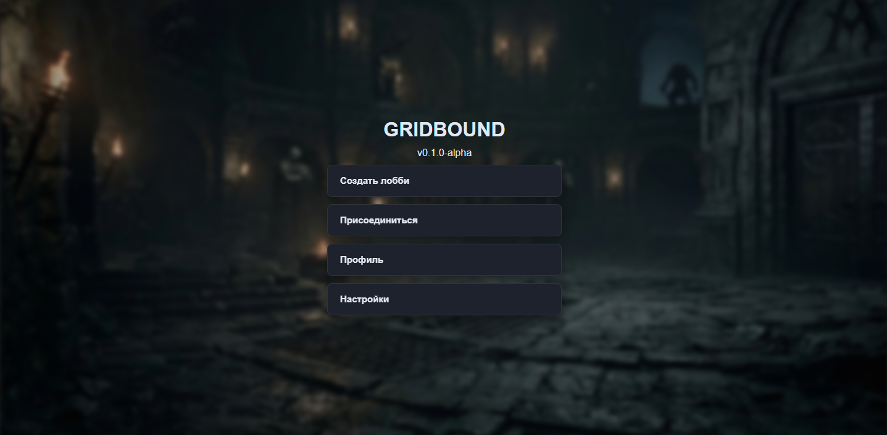
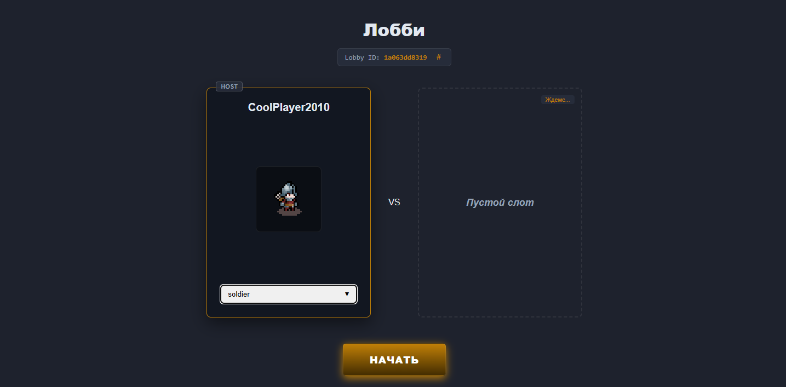
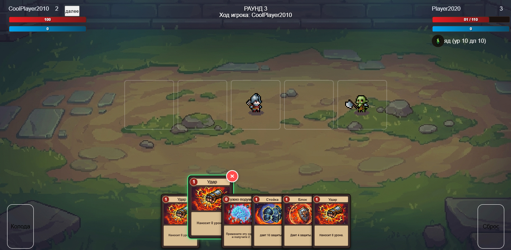
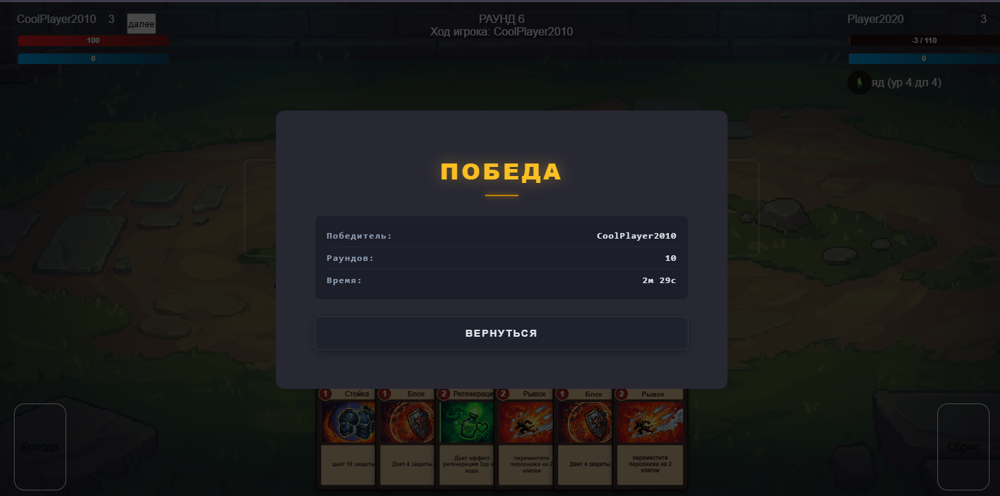

# Gridbound

Gridbound — это пошаговая тактическая игра, в которой двое игроков сражаются на поле боя размером 5 клеток. Каждый игрок контролирует персонажа с уникальными способностями и вытягивает карты для ходов.

## Стек технологий

### Backend
- **Node.js** 
- **Express.js** 
- **express-ws** 

### Frontend
- **React 19**
- **TypeScript** 
- **Vite**
- **MobX** 
- **React Router**

## Запуск проекта

### Установка

1. **Клонируйте репозиторий**
   ```bash
   git clone https://github.com/truk808/Gridbound.git
   cd Gridbound
   ```

2. **Установите зависимости backend**
   ```bash
   cd backend
   npm install
   cd ..
   ```

3. **Установите зависимости frontend**
   ```bash
   cd frontend
   npm install
   cd ..
   ```
4. **Настройте .env**

### Разработка

Запустите backend и frontend в отдельных терминалах:

**Терминал 1 - Backend (WebSocket сервер)**
```bash
cd backend
npm run dev
# Сервер запущен на http://localhost:5000
```

**Терминал 2 - Frontend (React приложение)**
```bash
cd frontend
npm run dev
# Приложение запущено на http://localhost:5173
```

Откройте [http://localhost:5173](http://localhost:5173) в браузере.

## Игровой процесс

1. **Создание/присоединение к лобби** - Игроки создают или присоединяются к комнате
 
2. **Выбор персонажа** - Выберите из доступных персонажей
  
4. **Начало игры** - Хост инициирует матч
5. **Цикл хода**:
6. 
   - Активный игрок вытягивает 6 карт
   - У игрока есть 3 пункта действия (AP)
   - Может двигать персонажа или разыгрывать карты
   - Может сбросить карты для получения новых
   - Завершить ход для передачи ходу противнику
6. **Победа** - Последний игрок с HP > 0 побеждает
   

## Основные игровые системы

### Система персонажей
- Каждый персонаж имеет HP, броню и статус-эффекты
- Персонажи могут двигаться по сетке

### Система карт
- Карты имеют стоимость AP и радиус действия (дальность)
- Условия определяют, можно ли разыграть карту
- Действия применяют эффекты (урон, исцеление, движение и т.д.)
- Карты могут иметь несколько действий с разными эффектами

### Система эффектов
- Статус-эффекты (оглушение, яд, щит и т.д.)
- Эффекты имеют длительность и длительность

### Система действий
- Каждый игрок получает 3 AP за ход
- Разыгрывание карт требует AP
- Движение требует AP

## [Демо проекта](http://188.120.236.242)

**Наслаждайтесь игрой!** 
